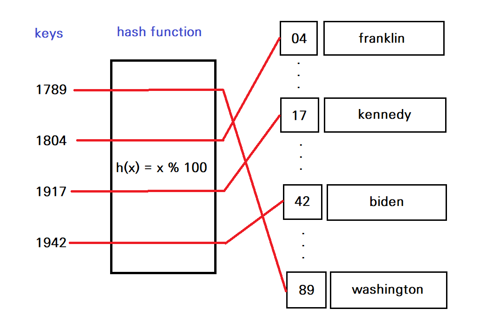

# Hash Table


### 해시 함수

- 임의의 크기를 가지는 type의 데이터를 고정된 크기를 가지는 type의 데이터(해시값)으로 변환하는 함수
- 같은 입력값에 대하여, 같은 출력값이 나오는 것이 보장된다.
- hash table에서는 **임의의 데이터를 정수(해시값)으로 변환하는 함수**


### 해시 테이블

- 해시 함수의 반환값(해시값)을 인덱스로 삼아 key와 value를 저장하는 자료구조
- 삽입, 삭제, 탐색 모두 평균 시간복잡도가 `O(1)`




### Dictionary와 Set

- 파이썬에서 dictionary와 set는 모두 해시 테이블 자료구조다.
  - dictionary는 hash table의 key, value를 모두 저장한다.
  - set은 hash table에서 key만 사용한다.

- dictionary, set에서 삽입, 삭제, 탐색의 평균 시간복잡도는 `O(1)`이다.
- 언제 dictionary, set을 사용할 수 있는가?
  - **순서를 몰라도 되는 경우**
  - **정렬할 필요가 없는 경우**
- 순서를 알아야 하거나, 정렬이 필요한 경우 => **List**를 사용한다.


### 예시 문제

**[Top K Frequent Elements](https://leetcode.com/problems/top-k-frequent-elements/)**

- 숫자 배열과 정수 k가 주어진 경우, 배열에 가장 많은 k개의 요소를 리턴한다. k개 요소의 순서는 상관 없다.

```bash
Input: nums = [1,1,1,2,2,3], k = 2
Output: [1,2]

Input: nums = [1], k = 1
Output: [1]
```


#### 풀이 1 : 딕셔너리 => O(nlogn)

```python
class Solution:
    def topKFrequent(self, nums: List[int], k: int) -> List[int]:
        num_count = dict()
        
        # 각 숫자의 출현 횟수를 num_count 딕셔너리에 저장
        for num in nums:
            num_count[num] = num_count.get(num, 0) + 1
        
        # (숫자, 출현 횟수)를 출현 횟수가 높은 순으로 정렬
        count_list = [(num, count) for num, count in num_count.items()]
        count_list.sort(key=lambda x:x[1], reverse=True)
        
        answer = []
        
        # 출현 횟수가 높은 순으로 k개의 숫자를 저장
        for i in range(k):
            answer.append(count_list[i][0])
        
        return answer
```


#### 풀이 2 : 딕셔너리 + 힙 => O(nlogk)

```python
from heapq import heappush, heappop, heapify


class Solution:
    def topKFrequent(self, nums: List[int], k: int) -> List[int]:
        num_count = dict()
        
        for num in nums:
            num_count[num] = num_count.get(num, 0) + 1
        
        heap = []
        heap_size = 0
        
        """
        1. heap의 요소가 k가 될 때까지 (count, num)을 넣는다.
        2. 그 이후로는 매번 (count, num)을 넣은 다음
           count가 최소인 (count, num)을 heap에서 pop한다.
        
        크기가 k인 heap에서 새로운 요소를 삽입/삭제하는 시간복잡도는 O(logk)
        따라서 n개의 요소를 삽입/삭제하는 총 시간복잡도는 O(nlogk)가 된다.
        """
        for num, count in num_count.items():
            if heap_size < k:
                heappush(heap, (count, num))
                heap_size += 1
            else:
                heappush(heap, (count, num))
                heappop(heap)
                    
        answer = []
        
        while heap:
            answer.append(heappop(heap)[1])
        
        return answer
```


#### 풀이 3 : 딕셔너리 + nlargest 메서드 활용

```bash
heapq.nlargest(n, iterable, key=None)

iterable에서 key를 기준으로 크기가 가장 큰 n개의 요소를 반환한다.
```

```python
from heapq import heappush, heappop, heapify, nlargest


class Solution:
    def topKFrequent(self, nums: List[int], k: int) -> List[int]:
        num_count = dict()
        
        for num in nums:
            num_count[num] = num_count.get(num, 0) + 1
        
        count_list = [(count, num) for num, count in num_count.items()]
        top_n_frequent = nlargest(k, count_list, lambda x: x[0])
        
        return [x[1] for x in top_n_frequent]
```


### 참고할 만한 자료

[해시 테이블 개념 설명 영상](https://www.youtube.com/watch?v=ZBu_slSH5Sk&ab_channel=%EC%89%AC%EC%9A%B4%EC%BD%94%EB%93%9C)

[Top K Frequent Elements 풀이 영상](https://www.youtube.com/watch?v=6CD5EzjCZPA&ab_channel=%EC%BD%94%EB%93%9C%EC%97%86%EB%8A%94%ED%94%84%EB%A1%9C%EA%B7%B8%EB%9E%98%EB%B0%8D)

[해시 테이블 개인적으로 정리한 글](https://github.com/by-gramm/TIL/blob/master/computer_science/hash_table.md)

