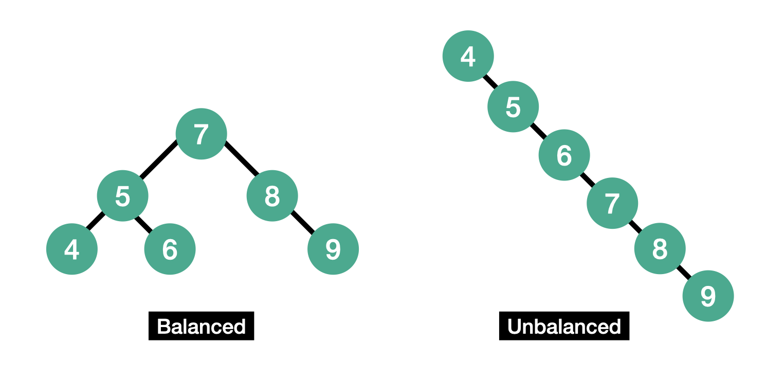

### index는 어떤 자료구조로 구현되어 있는가

- mongoDB의 경우, b-tree 자료구조를 사용한다.
- mySQL의 경우, b+tree 자료구조를 사용하는데, 이는 b-tree의 확장된 개념이다.

**b-tree 자료구조**

- 자식 트리의 밸런스를 유지하는 **balanced tree**의 일종
- 최악의 경우 탐색의 시간복잡도가 `O(N)`인 이진 탐색 트리와 달리, 최악의 경우에도 시간복잡도가 `O(logN)`이다.



Q. 해시 테이블의 탐색 시간은 `O(1)`인데, 왜 b-tree 자료구조를 사용했을까?

A. 해시 테이블의 경우 값이 정렬되어 있지 않다. 따라서 범위 내의 값을 검색하거나, 정렬된 결과를 가져오는 데 사용할 수 없다.

회원정보 테이블에서 나이를 인덱스로 설정했다고 하자. (물론 이는 별로 좋지 않은 선택일 것이다.) 인덱스를 해시 테이블로 구현할 경우, 나이가 24살인 회원은 매우 빠르게 찾을 수 있다. 하지만 나이가 30대인 회원을 찾거나, 나이가 많은 순으로 10명의 회원을 찾는 데 있어서는 인덱스의 도움을 받지 못할 것이다.

<br>

### 표 편집 문제 풀이


#### **문제 접근**

주어진 표에 대하여, 아래의 4가지 명령어의 목록이 주어진다.

1. `U X` : X칸 앞의 행 선택하기
2. `D X` : X칸 뒤의 행 선택하기
3. `X` : 현재 행 삭제 후, 바로 아래 행 선택하기 (단, 마지막 행을 삭제한 경우 바로 윗 행 선택)
4. `Z` : 가장 최근에 삭제한 행 복구하기

표의 행의 개수는 최대 1,000,000개이며, 명령어는 최대 200,000개가 주어진다.

<br>

순서가 있는 데이터를 저장하는 자료구조는 크게 Array와 Linked List가 있다. 

**Array**

- 탐색의 시간 복잡도 : `O(1)`
- 삽입/삭제의 시간 복잡도 : `O(N)`

**Linked List**

- 탐색의 시간 복잡도 : `O(N)`
- 삽입/삭제의 시간 복잡도 : `O(1)`

위 문제에서는 삽입/삭제가 자주 일어난다. 따라서 매 삽입/삭제 시마다 `O(N)`이 소요되는 Array보다는 Linked List를 사용하는 것이 시간 효율적이다. 

또한 위 문제에서는 인덱스로 값을 찾는 것이 아니라, 현재 행에서 X칸 앞/뒤의 데이터를 탐색한다. 따라서 Linked List에서도 `O(X)`의 시간 복잡도로 값을 검색할 수 있다. 문제의 조건상 X의 총합이 100만 이하이므로, 탐색에서의 시간 복잡도 문제도 발생하지 않는다.


#### 클래스 없는 풀이

이중 연결 리스트를 직접 구현하는 대신, 각 노드의 이전/이후 노드의 인덱스를 각각 left, right 리스트에 저장하는 방식으로 구현했다.

```python
from collections import deque


def solution(n, k, cmd):
    # left[i]: i번째 노드의 이전 노드의 인덱스
    left = [i - 1 for i in range(n)]
    left[0] = None
    
    # right[i]: i번째 노드의 다음 노드의 인덱스
    right = [i + 1 for i in range(n)]
    right[n - 1] = None
    
    deleted = deque()
    current = k
        
    for x in cmd:
        if x == 'Z':
            num = deleted.pop()
            
            if left[num]:
                right[left[num]] = num
            if right[num]:
                left[right[num]] = num
        elif x == 'C':
            deleted.append(current)
            
            # 현재 노드가 head node인 경우
            if left[current] is None:
                left[right[current]] = None
                current = right[current]
            # 현재 노드가 tail node인 경우
            elif right[current] is None:
                right[left[current]] = None
                current = left[current]
            # 현재 노드가 head node나 tail node가 아닌 경우
            else:
                right[left[current]] = right[current]
                left[right[current]] = left[current]
                current = right[current]
        else:
            command, num = x.split()
        
            if command == 'U':
                for _ in range(int(num)):
                    current = left[current]
            else:
                for _ in range(int(num)):
                    current = right[current]
    
    result = ["O"] * n
    
    while deleted:
        result[deleted.pop()] = "X"
    
    return "".join(result)
```

길이가 최대 100만인 리스트가 3개(node_list, left, right) 만들어지기 때문에 공간 효율성은 떨어질 수 있지만, 이전/이후 노드를 인덱스만으로 접근하기 때문에 시간적으로는 첫번째 정답 풀이보다 더욱 효율적이다.